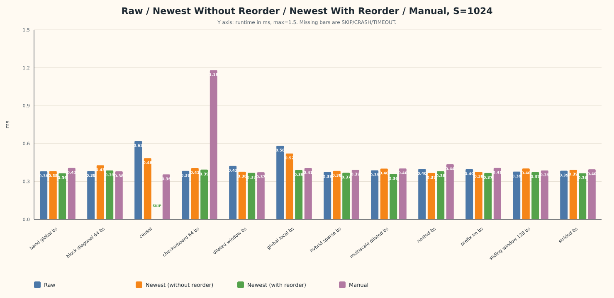
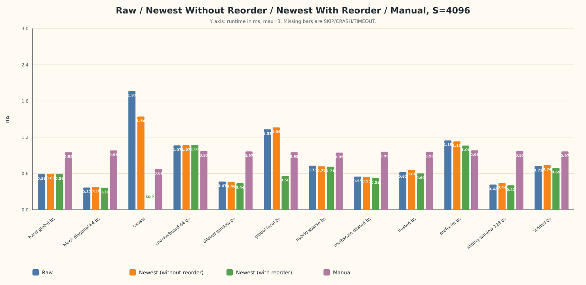
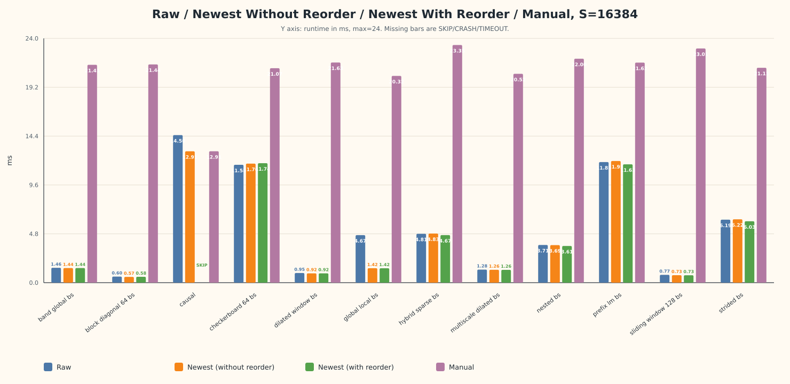
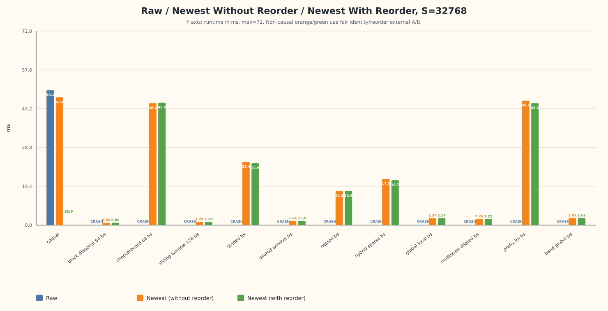
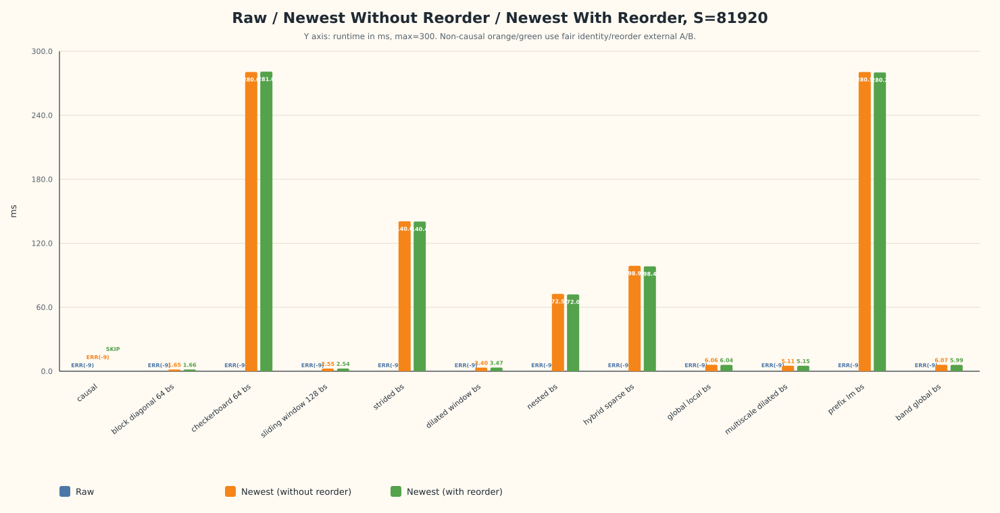

# Flex Attention NPU 优化总结报告

> 日期: 2026-06-17  
> 设备: Ascend NPU 60GB  
> 精度: bfloat16  
> 主要对比: Raw flex / Newest without reorder / Newest with external reorder / Manual reference

## 1. 核心结论

1. **Causal 不需要 reorder**。Newest 的 causal dense fastpath 已经能带来稳定收益，短中序列约 `1.1x-1.37x`，长序列仍有 `1.04x-1.09x`。
2. **12 种稀疏模式能跑通的关键不是 row reorder，而是 FULL_KV / PURE_BLOCK_SPARSE 路径**。它把复杂 `mask_mod` subgraph 移到 host 侧生成 metadata，绕开 bishengir 对 `//`、`%`、`torch.where`、tensor index 等 lowering 的不稳定。
3. **16K 上 row/KV reorder 本身确实有用，但集中在部分模式**。公平 A/B（identity external vs reorder external）下，`strided_bs`、`hybrid_sparse_bs`、`prefix_lm_bs`、`nested_bs` 有约 `2%-3%` 收益；`global_local_bs` 的端到端大收益主要来自 external/FULL_KV 路径，不是 row reorder 本身。
4. **32K/80K 下普通 no-reorder vs reorder/external 不是公平 speedup**。Raw 和 Newest without reorder 在非 causal FULL_KV sparse 长序列下无法稳定完成；因此不能用普通路径的 `CRASH/ERR(-9)` 去计算 reorder 加速。
5. **公平 A/B 口径是 identity external vs reorder external**。两边都预先重排/拷贝 Q 和 sparse metadata，只改变 row/KV order。32K 下 `hybrid_sparse_bs / prefix_lm_bs / strided_bs` 有 `~2%-3%` 收益；80K 下收益更混合，`band_global_bs` 约 `1.0134x`，`hybrid_sparse_bs` 复跑后约 `1.0051x`。
6. **reorder/external 仍需要 selector 白名单**。本轮 32K/80K 公平复测中 correctness 基本通过，但收益和退化都存在，不能默认全模式开启。

## 2. 实现口径

### 2.1 四条测试路径

| 路径 | 含义 | 主要用途 |
|---|---|---|
| Raw flex | 部署 `raw_flex` 后运行 `--target flex` | 原始实现基线 |
| Newest without reorder | 部署 `Newest` 后运行 `--target flex` | 新版普通 flex 路径 |
| Newest with reorder | `--target reorder --enable-block-reorder --block-reorder-impl external --block-reorder-mode wave_overlap --kv-order snake_inv` | external reorder 路径 |
| Manual | `--target manual --no-compare` | Python/torch 参考实现或 dense reference |

### 2.2 公平性说明

`Newest with reorder/external` 不是只“换执行顺序”。它会在 kernel 外提前重排 Q 和 sparse metadata，让 flex kernel 继续走更稳定的单 tile / pure block-sparse 模板。  

因此报告里把两类问题分开：

- **可运行性对比**：Raw / Newest without reorder 是否能跑完。
- **公平 reorder A/B**：identity external vs wave_overlap reorder external。只有这个口径能比较 reorder 本身收益或退化。

## 3. 稀疏模式支持: Subgraph -> Metadata

原始实现通过 `mask_mod(b, h, q_idx, kv_idx)` 在 kernel 内动态计算稀疏 pattern。bishengir 对这类 subgraph 不稳定：

| 操作 | 风险 | 受影响模式 |
|---|---|---|
| `//` | `bool_to_bool_rintmode` crash | nested, strided, checkerboard, dilated, hybrid 等 |
| `%` | `aten.remainder.Scalar` lowering 失败 | 多数规则稀疏 |
| `torch.where` 链 | segfault / UB overflow | global_local, band_global |
| tensor index | NPU 不支持 tensor 下标索引 | random/alibi 类模式 |

当前方案把复杂逻辑全部移到 host 侧：

1. `pattern_to_block_mask.py` 生成 block-level bool mask。
2. `block_mask_to_full_kv()` 转换为 `FULL_KV_NUM_BLKS / FULL_KV_IDX` metadata。
3. PURE_BLOCK_SPARSE kernel 删除 `mask_mod` / `score_mod` subgraph，只按 metadata 遍历有效 KV blocks。

重要口径：**FULL_KV 不等于 dense**。FULL_KV 表示“有效 block 走 full-block metadata 路径”，不是把所有 KV block 都标记有效。每行实际加载的 block 数仍由 `full_kv_num_blocks` 决定。

## 4. Causal Fastpath

Newest 新增 causal dense fastpath，使用 3 输入专用模板，无 subgraph。Causal 本身自然局部性强，默认不启用 reorder。

| Shape | Raw | Newest | Speedup |
|---|---:|---:|---:|
| 1,2,1024 | 0.60 ms | 0.46 ms | 1.29x |
| 1,2,2048 | 0.99 ms | 0.72 ms | 1.37x |
| 1,2,4096 | 1.92 ms | 1.49 ms | 1.29x |
| 1,2,8192 | 4.79 ms | 3.93 ms | 1.22x |
| 2,4,8192 | 17.5 ms | 14.2 ms | 1.23x |
| 4,8,8192 | 67.9 ms | 55.4 ms | 1.22x |
| 1,2,16384 | 14.4 ms | 13.0 ms | 1.11x |
| 4,8,16384 | 219 ms | 195 ms | 1.12x |
| 2,4,32768 | 196 ms | 184 ms | 1.07x |
| 1,2,49152 | 108 ms | 103 ms | 1.04x |
| 1,2,65536 | 196 ms | 180 ms | 1.09x |

## 5. 1K / 4K / 16K 总表

测试配置：`B=1, H=2, D=128`。Flex / Reorder 使用 `warmup=3, repeat=5`；Manual 使用 `warmup=1, repeat=3`。

### 5.1 图表

注：`S=16384` 图中的橙色/绿色柱使用公平 A/B 数据，即 `Identity external` / `Reorder external`；Raw 和 Manual 仍使用原四路径矩阵数据。

### 5.2 关键观察

- `causal` 不启用 reorder；Newest causal fastpath 在 `S=1024/4096/16384` 分别为 `1.2810x / 1.2748x / 1.1237x`。
- 端到端表中，`strided_bs` 在三档短中序列上 reorder/external 都有正收益：`1.0767x / 1.0677x / 1.0343x`。
- 16K 下多数 FULL_KV sparse 模式有 `1.003x-1.055x` 的 reorder/external 路径收益，但这张端到端表混入了 external/FULL_KV 路径差异。
- 更公平的 16K identity external vs reorder external 表显示：`strided_bs`、`hybrid_sparse_bs`、`prefix_lm_bs`、`nested_bs` 的 row/KV reorder 本身仍有 `2%-3%` 收益。
- `global_local_bs` 的端到端 `2.4x-3.3x` 大幅收益不能归因于 row reorder；公平 A/B 下只有 `1.0042x`，主要收益来自 external FULL_KV / pure block-sparse 路径差异。
- Manual 在小/中序列部分模式有竞争力，尤其 `causal@1024/4096`；但 16K 下除 causal 外多数 FULL_KV sparse manual 已明显慢于 Newest。

### 5.3 详细数据

| Seq Len | Config | Raw flex | Newest (without reorder) | Newest (with reorder) | Manual | Raw/Newest(no reorder) | Newest(no reorder)/Newest(with reorder) | Manual/Newest(no reorder) | Notes |
|--------:|--------|---------:|-------------------------:|----------------------:|-------:|-----------------------:|----------------------------------------:|--------------------------:|-------|
| 1024 | `band_global_bs` | 0.380 | 0.382 | 0.365 | 0.407 | 0.9948x | 1.0466x | 1.0654x | - |
| 1024 | `block_diagonal_64_bs` | 0.383 | 0.428 | 0.387 | 0.380 | 0.8949x | 1.1059x | 0.8879x | manual 更快 |
| 1024 | `causal` | 0.620 | 0.484 | SKIP | 0.356 | 1.2810x | - | 0.7355x | causal 不启用 reorder; manual 更快 |
| 1024 | `checkerboard_64_bs` | 0.384 | 0.406 | 0.394 | 1.180 | 0.9458x | 1.0305x | 2.9064x | - |
| 1024 | `dilated_window_bs` | 0.423 | 0.377 | 0.368 | 0.373 | 1.1220x | 1.0245x | 0.9894x | manual 基本持平 |
| 1024 | `global_local_bs` | 0.583 | 0.521 | 0.390 | 0.406 | 1.1190x | 1.3359x | 0.7793x | manual 快于 Newest |
| 1024 | `hybrid_sparse_bs` | 0.375 | 0.384 | 0.369 | 0.393 | 0.9766x | 1.0407x | 1.0234x | - |
| 1024 | `multiscale_dilated_bs` | 0.388 | 0.402 | 0.359 | 0.403 | 0.9652x | 1.1198x | 1.0025x | - |
| 1024 | `nested_bs` | 0.399 | 0.367 | 0.381 | 0.436 | 1.0872x | 0.9633x | 1.1880x | reorder 略慢 |
| 1024 | `prefix_lm_bs` | 0.397 | 0.376 | 0.367 | 0.407 | 1.0559x | 1.0245x | 1.0824x | - |
| 1024 | `sliding_window_128_bs` | 0.378 | 0.403 | 0.374 | 0.387 | 0.9380x | 1.0775x | 0.9603x | manual 快于 Newest |
| 1024 | `strided_bs` | 0.385 | 0.393 | 0.365 | 0.396 | 0.9796x | 1.0767x | 1.0076x | - |
| 4096 | `band_global_bs` | 0.589 | 0.596 | 0.589 | 0.953 | 0.9883x | 1.0119x | 1.5990x | - |
| 4096 | `block_diagonal_64_bs` | 0.369 | 0.379 | 0.365 | 0.982 | 0.9736x | 1.0384x | 2.5910x | - |
| 4096 | `causal` | 1.967 | 1.543 | SKIP | 0.676 | 1.2748x | - | 0.4381x | causal 不启用 reorder; manual 更快 |
| 4096 | `checkerboard_64_bs` | 1.066 | 1.068 | 1.074 | 0.971 | 0.9981x | 0.9944x | 0.9092x | reorder 略慢; manual 更快 |
| 4096 | `dilated_window_bs` | 0.468 | 0.460 | 0.441 | 0.967 | 1.0174x | 1.0431x | 2.1022x | - |
| 4096 | `global_local_bs` | 1.332 | 1.363 | 0.562 | 0.953 | 0.9773x | 2.4253x | 0.6992x | external FULL_KV 路径收益显著 |
| 4096 | `hybrid_sparse_bs` | 0.729 | 0.719 | 0.714 | 0.946 | 1.0139x | 1.0070x | 1.3157x | - |
| 4096 | `multiscale_dilated_bs` | 0.549 | 0.545 | 0.524 | 0.960 | 1.0073x | 1.0401x | 1.7615x | - |
| 4096 | `nested_bs` | 0.622 | 0.662 | 0.601 | 0.959 | 0.9396x | 1.1015x | 1.4486x | - |
| 4096 | `prefix_lm_bs` | 1.148 | 1.132 | 1.063 | 0.983 | 1.0141x | 1.0649x | 0.8684x | manual 更快 |
| 4096 | `sliding_window_128_bs` | 0.417 | 0.443 | 0.405 | 0.970 | 0.9413x | 1.0938x | 2.1896x | - |
| 4096 | `strided_bs` | 0.725 | 0.741 | 0.694 | 0.967 | 0.9784x | 1.0677x | 1.3050x | - |
| 16384 | `band_global_bs` | 1.464 | 1.437 | 1.424 | 21.407 | 1.0188x | 1.0091x | 14.8970x | - |
| 16384 | `block_diagonal_64_bs` | 0.598 | 0.598 | 0.567 | 21.443 | 1.0000x | 1.0547x | 35.8579x | - |
| 16384 | `causal` | 14.502 | 12.906 | SKIP | 12.911 | 1.1237x | - | 1.0004x | causal 不启用 reorder |
| 16384 | `checkerboard_64_bs` | 11.579 | 11.732 | 11.808 | 21.072 | 0.9870x | 0.9936x | 1.7961x | full row rerun; reorder 略慢 |
| 16384 | `dilated_window_bs` | 0.946 | 0.943 | 0.908 | 21.633 | 1.0032x | 1.0385x | 22.9406x | - |
| 16384 | `global_local_bs` | 4.667 | 4.676 | 1.413 | 20.315 | 0.9981x | 3.3093x | 4.3445x | external FULL_KV 路径收益显著 |
| 16384 | `hybrid_sparse_bs` | 4.806 | 4.815 | 4.644 | 23.350 | 0.9981x | 1.0368x | 4.8494x | - |
| 16384 | `multiscale_dilated_bs` | 1.282 | 1.261 | 1.257 | 20.523 | 1.0167x | 1.0032x | 16.2752x | - |
| 16384 | `nested_bs` | 3.707 | 3.708 | 3.599 | 22.004 | 0.9997x | 1.0303x | 5.9342x | - |
| 16384 | `prefix_lm_bs` | 11.847 | 12.032 | 11.626 | 21.620 | 0.9846x | 1.0349x | 1.7969x | - |
| 16384 | `sliding_window_128_bs` | 0.771 | 0.759 | 0.734 | 23.007 | 1.0158x | 1.0341x | 30.3123x | - |
| 16384 | `strided_bs` | 6.189 | 6.243 | 6.036 | 21.112 | 0.9914x | 1.0343x | 3.3817x | - |

### 5.4 16K 公平 reorder A/B

这张表只比较 **identity external vs reorder external**，两边都有相同的 external Q/metadata 处理，只改变 row/KV order。它比 5.3 的 Newest no-reorder vs Newest with reorder 更适合判断 row reorder 本身是否有效。

完整结果见 [fair_reorder_16k.md](fair_reorder_16k.md)。

| Config | Identity ms | Reorder ms | Speedup | allclose | 结论 |
|--------|------------:|-----------:|--------:|----------|------|
| `block_diagonal_64_bs` | 0.567 | 0.576 | 0.9844x | True | reorder 略慢 |
| `checkerboard_64_bs` | 11.695 | 11.736 | 0.9965x | True | 基本持平 |
| `sliding_window_128_bs` | 0.735 | 0.730 | 1.0068x | True | 小幅收益 |
| `strided_bs` | 6.223 | 6.030 | 1.0320x | True | 明确收益 |
| `dilated_window_bs` | 0.917 | 0.916 | 1.0011x | True | 基本持平 |
| `nested_bs` | 3.687 | 3.606 | 1.0225x | True | 明确收益 |
| `hybrid_sparse_bs` | 4.826 | 4.674 | 1.0325x | True | 明确收益 |
| `global_local_bs` | 1.422 | 1.416 | 1.0042x | True | 端到端大收益主要来自 external 路径 |
| `multiscale_dilated_bs` | 1.264 | 1.260 | 1.0032x | True | 基本持平 |
| `prefix_lm_bs` | 11.952 | 11.628 | 1.0279x | True | 明确收益 |
| `band_global_bs` | 1.438 | 1.438 | 1.0000x | True | 持平 |

## 6. 32K / 80K 长序列

测试配置：`B=1, H=2, D=128`。Raw / Newest / Reorder 使用 `warmup=3, repeat=5`。

### 6.1 图表

注：`S=32768/81920` 图中的橙色/绿色柱使用公平 A/B 数据，即 `Identity external` / `Reorder external`；Raw 仍使用原长序列矩阵数据。`causal` 没有纳入 reorder fair A/B，仍保留原矩阵口径。

### 6.2 性能表

这张表和 6.1 图表使用同一口径：Raw 来自原长序列矩阵；`Newest (without reorder)` 是 `identity external`；`Newest (with reorder)` 是 `wave_overlap reorder external`。`Speedup = without / with`。

| Seq Len | Config | Raw | Newest (without reorder) | Newest (with reorder) | Speedup | allclose | 结论 |
|--------:|--------|----:|-------------------------:|----------------------:|--------:|----------|------|
| 32768 | `causal` | 50.059 | 47.401 | SKIP | - | - | causal 不启用 reorder; Newest/Raw 1.0561x |
| 32768 | `block_diagonal_64_bs` | CRASH | 0.862 | 0.848 | 1.0165x | True | 明确收益 |
| 32768 | `checkerboard_64_bs` | CRASH | 45.242 | 45.445 | 0.9955x | True | reorder 略慢 |
| 32768 | `sliding_window_128_bs` | CRASH | 1.204 | 1.204 | 1.0000x | True | 基本持平 |
| 32768 | `strided_bs` | CRASH | 23.404 | 22.949 | 1.0198x | True | 明确收益 |
| 32768 | `dilated_window_bs` | CRASH | 1.540 | 1.539 | 1.0006x | True | 基本持平 |
| 32768 | `nested_bs` | CRASH | 12.648 | 12.644 | 1.0003x | True | 基本持平 |
| 32768 | `hybrid_sparse_bs` | CRASH | 17.161 | 16.661 | 1.0300x | True | 明确收益 |
| 32768 | `global_local_bs` | CRASH | 2.566 | 2.572 | 0.9977x | True | 基本持平 |
| 32768 | `multiscale_dilated_bs` | CRASH | 2.257 | 2.227 | 1.0135x | True | 明确收益 |
| 32768 | `prefix_lm_bs` | CRASH | 46.196 | 45.232 | 1.0213x | True | 明确收益 |
| 32768 | `band_global_bs` | CRASH | 2.611 | 2.619 | 0.9969x | True | reorder 略慢 |
| 81920 | `causal` | ERR(-9) | ERR(-9) | SKIP | - | - | causal 不启用 reorder; 80K 原矩阵未跑通 |
| 81920 | `block_diagonal_64_bs` | ERR(-9) | 1.651 | 1.657 | 0.9964x | True | reorder 略慢 |
| 81920 | `checkerboard_64_bs` | ERR(-9) | 280.581 | 280.960 | 0.9987x | True | 基本持平 |
| 81920 | `sliding_window_128_bs` | ERR(-9) | 2.552 | 2.540 | 1.0047x | True | 小幅收益 |
| 81920 | `strided_bs` | ERR(-9) | 140.613 | 140.369 | 1.0017x | True | 基本持平 |
| 81920 | `dilated_window_bs` | ERR(-9) | 3.405 | 3.467 | 0.9821x | True | reorder 变慢 |
| 81920 | `nested_bs` | ERR(-9) | 72.539 | 72.044 | 1.0069x | True | 小幅收益 |
| 81920 | `hybrid_sparse_bs` | ERR(-9) | 98.857 | 98.357 | 1.0051x | True | 小幅收益 |
| 81920 | `global_local_bs` | ERR(-9) | 6.059 | 6.043 | 1.0026x | True | 基本持平 |
| 81920 | `multiscale_dilated_bs` | ERR(-9) | 5.112 | 5.149 | 0.9928x | True | reorder 略慢 |
| 81920 | `prefix_lm_bs` | ERR(-9) | 280.546 | 280.162 | 1.0014x | True | 基本持平 |
| 81920 | `band_global_bs` | ERR(-9) | 6.071 | 5.991 | 1.0134x | True | 明确收益 |

### 6.3 公平 correctness A/B

长序列公平 A/B 使用 **identity external output vs wave_overlap reorder output**，两边都走 external Q/metadata 路径，只改变 row/KV order。测试使用 `warmup=3, repeat=5`，容差：`rtol=0.03, atol=0.03`。完整 correctness 明细见 [fair_reorder_32k_80k.md](fair_reorder_32k_80k.md)。

长序列结论：

- Raw 和 Newest without reorder 在 32K/80K 非 causal sparse 上没有稳定完成，因此不能作为公平 speedup 分母。
- 已通过 correctness 的行均 `allclose=True`，最大绝对误差不超过 `0.003906`。
- 32K 下 reorder 本身更有价值：`hybrid_sparse_bs 1.0300x`、`prefix_lm_bs 1.0213x`、`strided_bs 1.0198x`。
- 80K 下收益更混合：`band_global_bs 1.0134x` 最明显，`hybrid_sparse_bs` 复跑后为 `1.0051x`，`strided_bs` 只有 `1.0017x`，`dilated_window_bs` 和 `multiscale_dilated_bs` 退化。
- `81920 hybrid_sparse_bs` 单独复跑后 reorder external 已通过 correctness，但收益只有约 `0.5%`，建议仍按白名单谨慎启用。

## 7. 历史 B/C 消融结论

早期 B/C 消融把 PURE_BLOCK_SPARSE 与 wave_overlap reorder 拆开测：

- Path B = PURE_BLOCK_SPARSE，无 reorder。
- Path C = PURE_BLOCK_SPARSE + wave_overlap reorder。
- B/C 用于估计 row reorder 单独贡献。

历史结果显示，在 `S=32768/49152/65536`、`B=2,H=4` 配置下，B/C 基本落在 `0.995x-1.010x`，多数是噪音级收益或退化。修复 spectral sort / wave partition / intra-wave NNZ sort / inter-wave scheduling 后，32K B/C 仍主要在 ±1% 内。

这说明 GPU 专利里的 wave scheduling 思路迁到 NPU 后，**不能直接期待普适加速**。NPU 当前最重要的收益仍来自 FULL_KV / PURE_BLOCK_SPARSE 模板；reorder 只在少数模式和长序列上出现小幅正信号。

## 8. 当前风险与下一步

风险：

- external reorder 和普通 no-reorder 路径不同，长序列性能表不能直接解释为普通 no-reorder 到 reorder 的 speedup。
- 部分模式 correctness 复跑中 reorder external crash，稳定性不足。
- block-level metadata 会牺牲 token-level mask 的细粒度表达能力；对 block-level pattern 等价，对精确 token-level pattern 可能有最多一个 block 边界误差。

下一步建议：

1. 优先修复 `band_global/checkerboard/global_local/prefix_lm` 的 external reorder crash。
2. 对 `strided_bs@80K` 做 repeat=20 或多轮冷启动，确认 `~1%` 公平收益是否稳定。
3. 给 selector 加白名单：只对 correctness 通过且收益稳定的模式启用 reorder。
4. 缓存 `perm + reordered metadata`，减少 host 侧 reorder 开销。
5. 继续保留 causal fastpath，不把 causal 纳入 reorder 优化目标。

## 9. 测试配置

- 设备: NPU Ascend 60GB
- 精度: bfloat16
- 编译: `torch.compile(backend="inductor", dynamic=False)`
- Block size: `SPARSE_Q_BLOCK_SIZE=128`, `SPARSE_KV_BLOCK_SIZE=128`
- 短中序列表: `B=1,H=2,D=128`, flex/reorder `warmup=3, repeat=5`, manual `warmup=1, repeat=3`
- 长序列表: `B=1,H=2,D=128`, raw/newest/reorder `warmup=3, repeat=5`, manual `warmup=1, repeat=3`
- 16K 公平 A/B: identity external vs wave_overlap reorder external, `warmup=3, repeat=5`, `rtol=0.03, atol=0.03`
- 32K/80K 公平 A/B: identity external vs wave_overlap reorder external, `warmup=3, repeat=5`, `rtol=0.03, atol=0.03`
